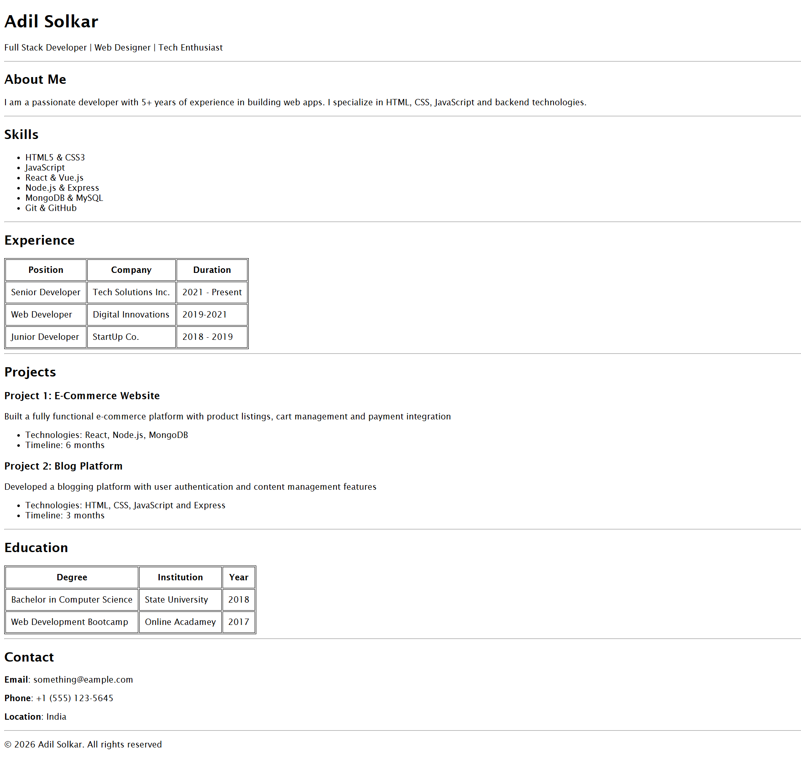

# HTML Assignment - Web Dev Cohort 2026

This repository contains the solution for the HTML resume page assignment as part of the Web Dev Cohort 2026.

## Project Description

The focus of this project was to structure a web page using proper HTML5 standards. Specifically, I utilized **semantic tags** to ensure better accessibility and code readability, including:

* `<header>`
* `<main>`
* `<footer>`

## Live Demo

Check out the live version of the assignment here:
**[https://html-resume-assignment.netlify.app/]**

## Screenshot

